# Order Processing Platform

A microservices-based order processing platform built with **Java 17**, **Spring Boot 3**, **Apache Kafka**, **PostgreSQL**, and **Server-Sent Events (SSE)**.

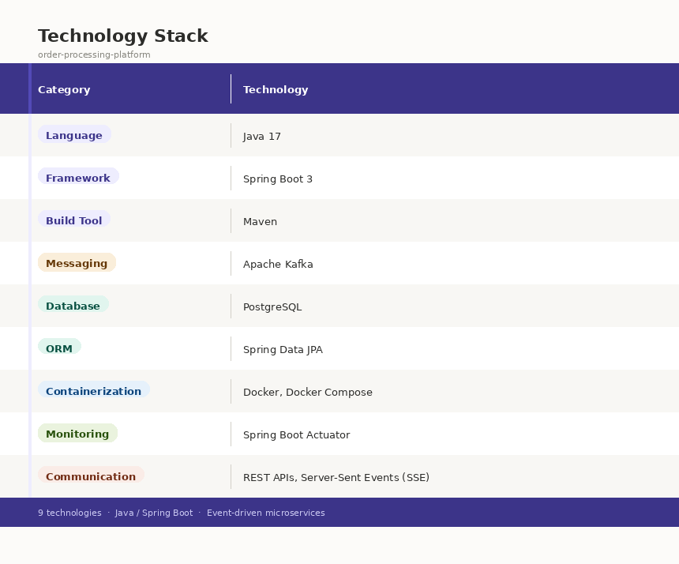

---

## Business Scenario

A customer places an order through the **Order Service**. 
The order is persisted in PostgreSQL and an event is published to Kafka. 
The **Notification Service** consumes this event and pushes a real-time update to any connected dashboard clients 
via SSE — enabling a live order tracking feed without polling.

---

## Architecture

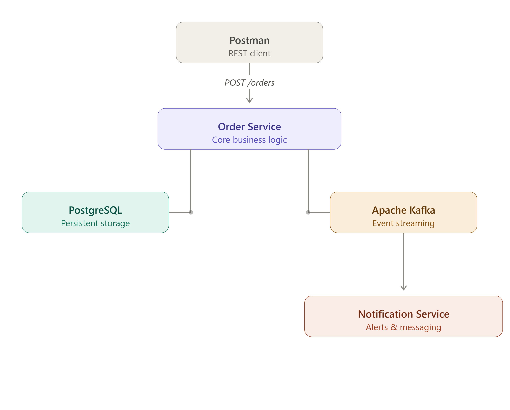
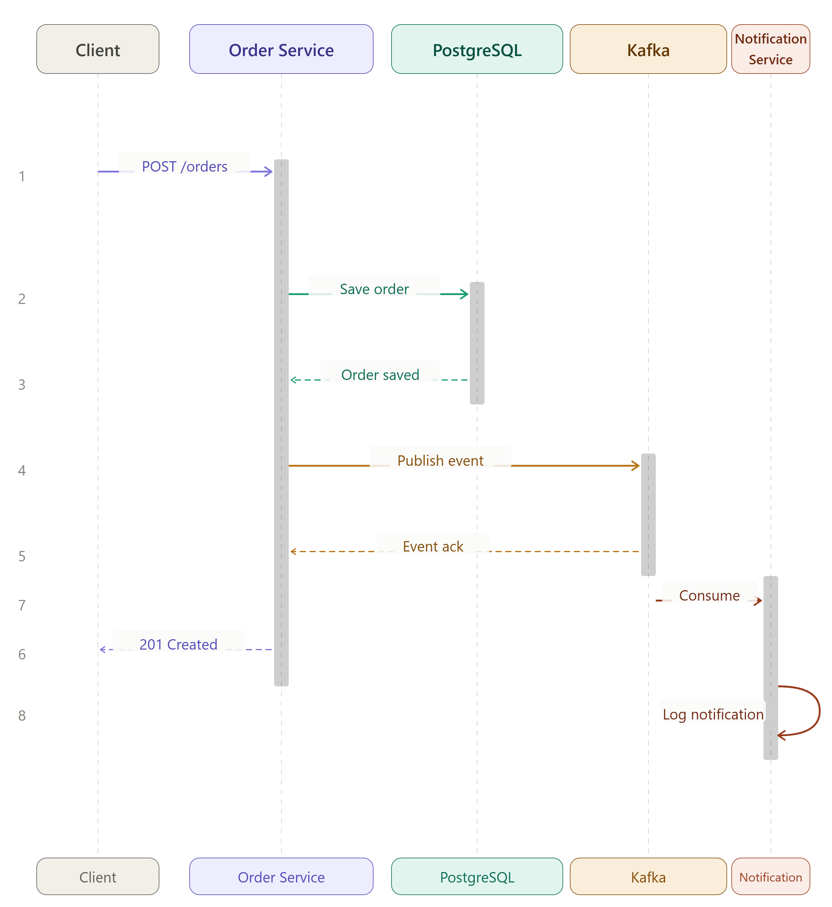
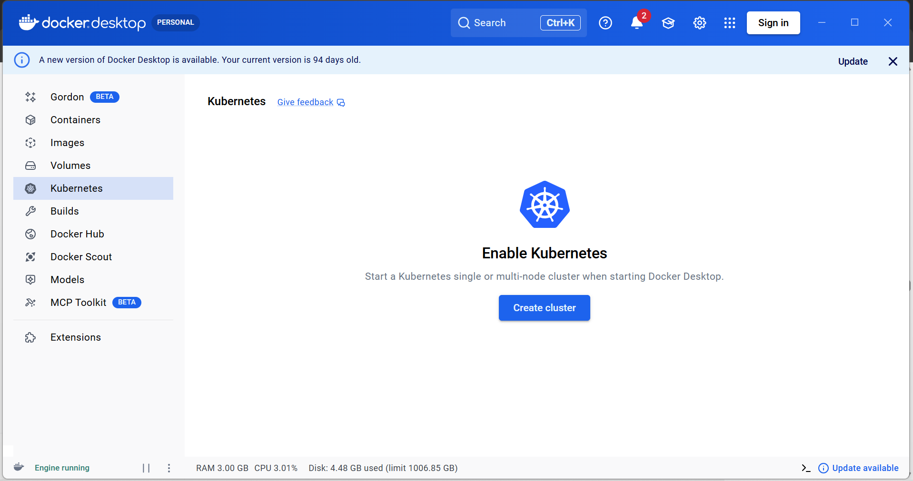
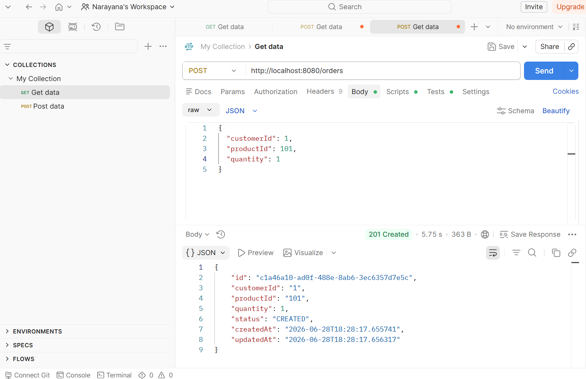
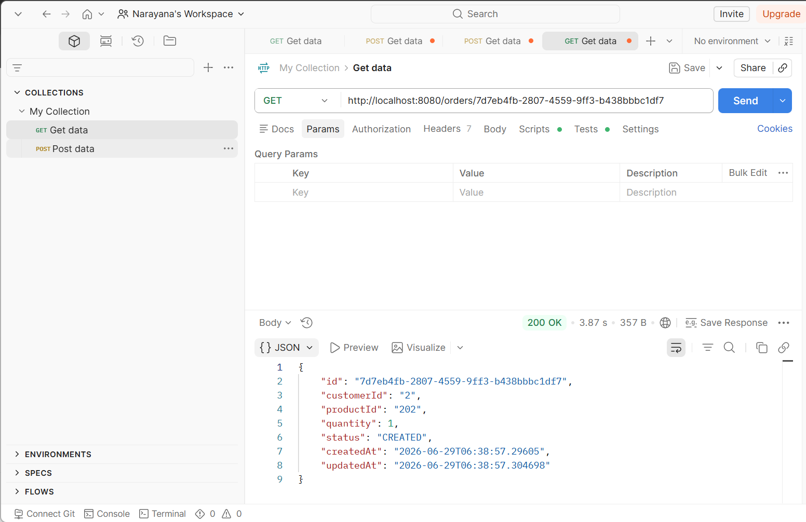
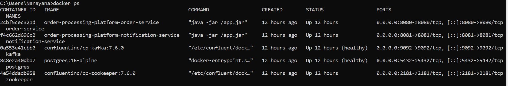
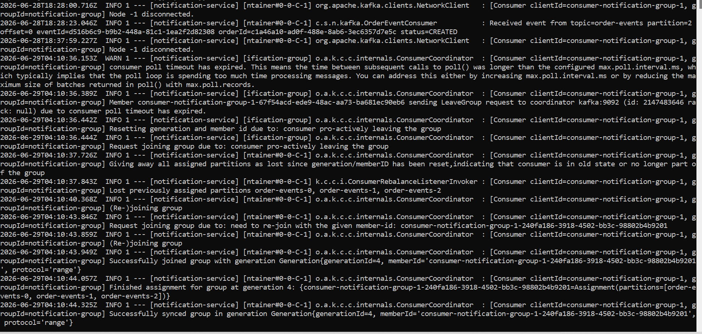
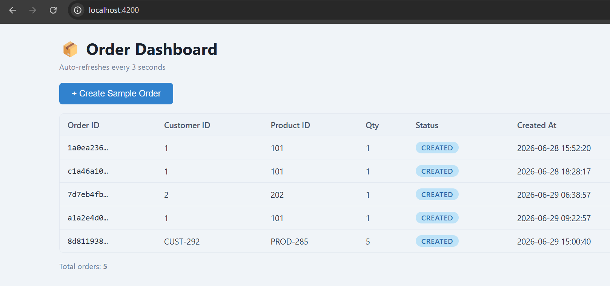
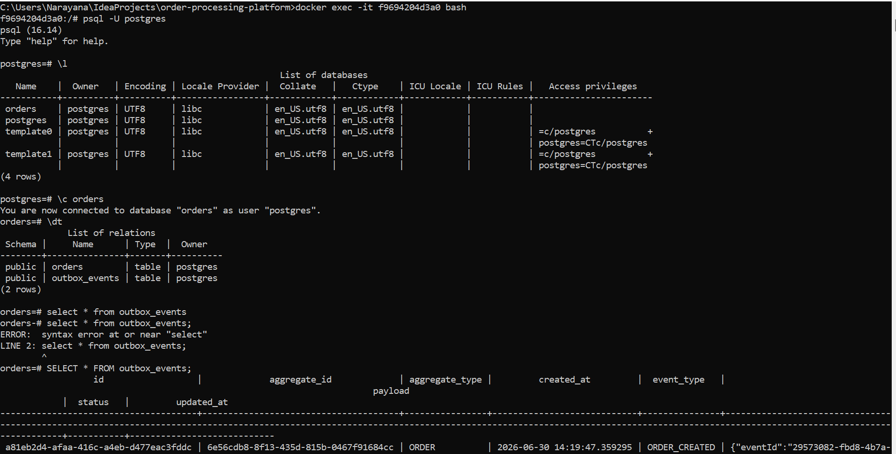
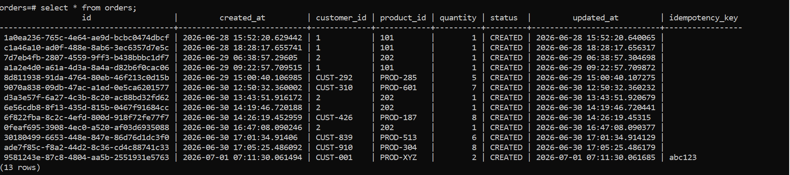
## Project Structure
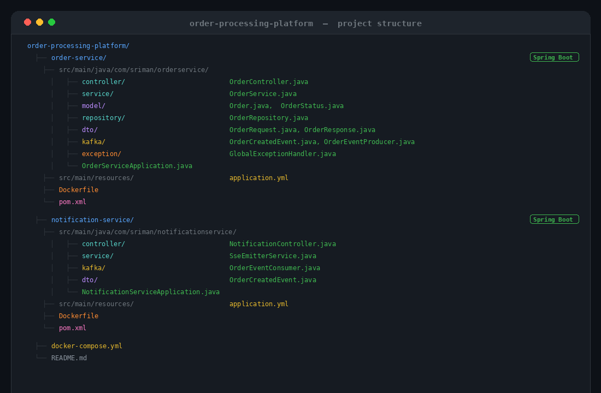

## How to Run

### Prerequisites

- Docker & Docker Compose installed
- Java 17 + Maven (only needed if building locally outside Docker)

### Step 1 — Build the JARs

# Build order-service
mvn clean package

# Build notification-service
mvn clean package

```

### Step 2 — Start Everything

docker-compose up --build
```

This starts:
| Container | Port |
|---|---|
| Zookeeper | 2181 |
| Kafka | 9092 |
| PostgreSQL | 5432 |
| Redis | 6379 |
| order-service | 8080 |
| notification-service | 8081 |

### Step 3 — Verify Health

curl http://localhost:8080/actuator/health
curl http://localhost:8081/actuator/health
```

### Stop

docker-compose down -v
```
## API Examples

### Create an Order

curl -X POST http://localhost:8080/orders \
  -H "Content-Type: application/json" \
  -d '{
    "customerId": "CUST-001",
    "productId": "PROD-XYZ",
    "quantity": 3
  }'
```

**Response (201 Created):**
```json
{
  "id": "a1b2c3d4-e5f6-7890-abcd-ef1234567890",
  "customerId": "CUST-001",
  "productId": "PROD-XYZ",
  "quantity": 3,
  "status": "CREATED",
  "createdAt": "2026-06-28T10:00:00",
  "updatedAt": "2026-06-28T10:00:00"
}
```

### Get an Order by ID

curl http://localhost:8080/orders/a1b2c3d4-e5f6-7890-abcd-ef1234567890
```

**Response (200 OK):** same JSON as above  
**Response (404 Not Found):** if the ID does not exist

### Subscribe to Real-Time Notifications (SSE)

curl -N http://localhost:8081/notifications/stream
```

Once subscribed, every new order created will push an event like:

```
event: order-event
data: {"eventId":"...","orderId":"...","customerId":"CUST-001","status":"CREATED","eventType":"ORDER_CREATED","createdAt":"2026-06-28T10:00:00"}
```

### Validation Error Example

curl -X POST http://localhost:8080/orders \
  -H "Content-Type: application/json" \
  -d '{"customerId": "", "productId": "PROD-XYZ", "quantity": 0}'
```

**Response (400 Bad Request):**
```json
{
  "timestamp": "2026-06-28T10:00:00",
  "status": 400,
  "error": "Validation Failed",
  "details": {
    "customerId": "customerId is required",
    "quantity": "quantity must be at least 1"
  }
}
```

## Kafka Event Flow

```
POST /orders
    │
    ▼
OrderService.createOrder()
    │  saves Order to PostgreSQL (status=CREATED)
    │
    ▼
OrderEventProducer.sendOrderEvent()
    │  publishes OrderCreatedEvent to topic: order-events
    │  key = orderId (ensures ordering per order)
    │
    ▼
Kafka topic: order-events
    │
    ▼
OrderEventConsumer (notification-service)
    │  @KafkaListener — logs event with topic/partition/offset
    │
    ▼
SseEmitterService.broadcast()
    │  sends JSON event to all active SSE connections
    │
    ▼
Connected dashboard clients receive real-time push
```

**Kafka Event Schema (`OrderCreatedEvent`):**

| Field | Type | Description |
|---|---|---|
| `eventId` | UUID | Unique ID for this event (idempotency) |
| `orderId` | UUID | The created order ID |
| `customerId` | String | Customer who placed the order |
| `status` | String | e.g., `CREATED` |
| `eventType` | String | e.g., `ORDER_CREATED` |
| `createdAt` | LocalDateTime | Event timestamp |

---

## Design Decisions

### Why Kafka?
Kafka decouples services — the Order Service does not need to know about the Notification Service. It is durable, ordered, and can handle high throughput (5,000+ orders/minute). New consumers (e.g., inventory, billing) can be added without changing the Order Service.

### Why PostgreSQL?
Orders are structured, relational data with clear fields. PostgreSQL provides ACID transactions ensuring no order is lost or partially written. It is well-supported by Spring Data JPA with minimal configuration.

### Why SSE for Real-Time Notifications?
SSE is simpler than WebSocket for one-directional server-to-client push. No additional protocol or library overhead. Works over standard HTTP — compatible with browsers, curl, and monitoring dashboards. Perfect for order status feeds.

### Scaling Strategy (5,000+ Orders/Minute)

| Layer | Strategy |
|---|---|
| **order-service** | Horizontal scaling behind a load balancer (stateless) |
| **Kafka** | Increase partitions on `order-events` to match consumer count |
| **notification-service** | Multiple instances, each in the same consumer group, handle different partitions |
| **PostgreSQL** | Connection pooling (HikariCP, default in Spring Boot), read replicas for GET queries |
| **SSE** | Each notification-service instance holds its own SSE connections; a message bus or shared Kafka topic handles cross-instance broadcast |

---

## Failure Handling Plan

| Failure Scenario | Approach |
|---|---|
| **Kafka unavailable** | Order Service: order is still saved to DB; Kafka publish fails silently with a logged error. *Conceptually*: use the Outbox Pattern — store events in a DB table and a separate process publishes them when Kafka is back. |
| **Service crash / restart** | `restart: on-failure` in Docker Compose. Kafka consumer auto-resumes from last committed offset on restart — no messages lost. |
| **Duplicate orders** | *Conceptually*: validate `eventId` in consumer before processing. Use a database unique constraint or idempotency key on the order. |
| **Database failure** | Order creation fails fast with a 500 error. No Kafka event is published (DB write happens before publish). *Conceptually*: implement retry with exponential backoff using Spring Retry. |
| **Duplicate Kafka events** | Consumer logs `eventId` and `orderId` for traceability. *Conceptually*: maintain a processed-events table keyed by `eventId` to skip duplicates. |

---

## Observability

Both services include **Spring Boot Actuator**:

| Endpoint | Description |
|---|---|
| `/actuator/health` | Service health (DB, Kafka) |
| `/actuator/info` | Application info |
| `/actuator/metrics` | JVM, HTTP, Kafka metrics |

**Structured Logging:** Both services log `orderId`, `eventId`, `customerId`, Kafka `topic/partition/offset` in every key operation for easy correlation.

---

| Feature | Details |
|---|---|
| `POST /orders` | Validates input, persists to PostgreSQL, publishes Kafka event, returns 201 |
| `GET /orders/{id}` | Fetches order from DB, returns 404 if not found |
| Kafka Producer | Publishes `OrderCreatedEvent` (JSON) to `order-events` topic |
| Kafka Consumer | Consumes events with `@KafkaListener`, logs topic/partition/offset |
| SSE Push | `GET /notifications/stream` — real-time push to connected clients |
| Exception Handling | `@ControllerAdvice` — validation errors (400), not found (404), generic (500) |
| Spring Boot Actuator | Health, info, metrics endpoints on both services |
| Structured Logging | `orderId`, `eventId`, Kafka metadata logged at each step |
| Docker Compose | Zookeeper, Kafka, PostgreSQL, both services with health checks |

---

## Angular Order Dashboard

A minimal Angular 17 standalone-component dashboard that creates orders, displays them in a live-refreshing table, and auto-updates every **3 seconds** using RxJS `interval` + `switchMap`.

### Prerequisites

| Tool | Minimum Version |
|---|---|
| Node.js | 18+ |
| npm | 9+ |
| Angular CLI | 17+ (`npm install -g @angular/cli@17`) |
| Spring Boot order-service | running on port 8080 |

### Run the Angular Dashboard

```bash
# 1. Start the Spring Boot backend first (Docker or local)
docker-compose up --build          # from Task/ root

# 2. Open a new terminal, navigate to the Angular project
cd order-dashboard

# 3. Install dependencies
npm install

# 4. Start the development server
ng serve
```

Open **http://localhost:4200** in your browser.

> ⚠️ The Spring Boot service **must be running on `http://localhost:8080`** before opening the dashboard. CORS is already configured for `http://localhost:4200`.

### Dashboard Features

| Feature | Details |
|---|---|
| **Create Sample Order** | Generates a random `customerId`, `productId`, and `quantity` then POSTs to `/orders` |
| **Order Table** | Shows `id`, `customerId`, `productId`, `quantity`, `status`, `createdAt` |
| **Auto-refresh** | Polls `GET /orders` every 3 seconds via `interval(3000).pipe(switchMap(...))` |
| **Status badges** | Color-coded: `CREATED` (blue) · `PROCESSING` (yellow) · `COMPLETED` (green) · `CANCELLED` (red) |
| **Feedback messages** | Success/error banners auto-dismiss after 4 seconds |

### Angular Project Structure

```
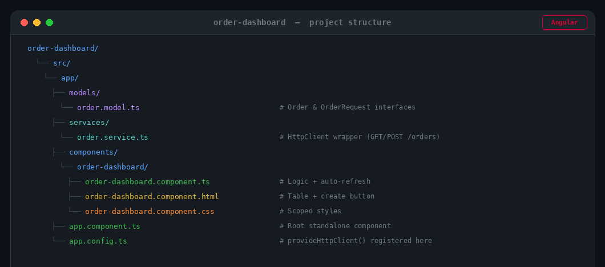

```

### New Backend Endpoint Added

`GET /orders` was added to the Spring Boot `order-service` to support the dashboard:

```
GET  http://localhost:8080/orders        → returns List<OrderResponse>
POST http://localhost:8080/orders        → creates a new order
GET  http://localhost:8080/orders/{id}   → gets order by UUID
```

---

## Resilience Patterns

The below basic resilience patterns have been implemented in `order-service` to make it more robust at an interview-demonstrable level.

---

### 1. Basic Resilience4j Circuit Breaker

**Why?** If Kafka becomes slow or unavailable, every publish attempt blocks for the full timeout. The circuit breaker detects repeated failures and "opens" — fail-fast for a cooldown period, then retries automatically.

**Where applied:** `OrderEventProducer.sendOrderEvent()` — the single Kafka publish call.

**Behaviour:**

| State | Condition |
|---|---|
| **CLOSED** (normal) | Calls pass through; failures counted |
| **OPEN** (tripped) | 50%+ of last 5 calls failed → fast-fail for 10 s |
| **HALF-OPEN** | After 10 s, 2 test calls allowed; if they pass → CLOSED |

**Fallback:** logs a warning and re-throws so `DomainEventPublisher` catches it and marks the event `FAILED` for retry.

**Config (application.yml):**
```yaml
resilience4j:
  circuitbreaker:
    instances:
      kafka-producer:
        sliding-window-size: 5
        failure-rate-threshold: 50
        wait-duration-in-open-state: 10s
        permitted-number-of-calls-in-half-open-state: 2
```

**Maven dependencies added (`pom.xml`):**
```xml
<dependency>
    <groupId>io.github.resilience4j</groupId>
    <artifactId>resilience4j-spring-boot3</artifactId>
    <version>2.2.0</version>
</dependency>
<dependency>
    <groupId>org.springframework.boot</groupId>
    <artifactId>spring-boot-starter-aop</artifactId>
</dependency>
```

---

### 2. Basic Idempotency

**Why?** On network retries or client double-clicks, the same order could be inserted twice. The idempotency key prevents this — the second request with the same key returns the already-created order.

**How to use:**

Include an optional `idempotencyKey` in the `POST /orders` body:

```json
{
  "customerId": "CUST-001",
  "productId": "PROD-XYZ",
  "quantity": 2,
  "idempotencyKey": "my-unique-request-id-abc123"
}
```

- **First request** → order is created normally; `idempotencyKey` stored in the `orders` table.
- **Duplicate request** (same key) → existing order returned immediately, nothing inserted.
- **No key provided** → behaves exactly as before (no change to existing callers).

**Files changed:**

| File | Change |
|---|---|
| `dto/OrderRequest.java` | Added optional `idempotencyKey` field |
| `model/Order.java` | Added `idempotencyKey` column (`UNIQUE`, nullable) |
| `repository/OrderRepository.java` | Added `findByIdempotencyKey(String)` |
| `service/OrderService.java` | Check key before insert; return existing order if found |

---

## Redis Caching

Basic read-through caching is applied to the `order-service` using **Spring Cache backed by Redis**.

| Endpoint | Cache Name | Eviction |
|---|---|---|
| `GET /orders/{id}` | `orders` (key = order UUID) | — |
| `GET /orders` | `all-orders` | Evicted on `POST /orders` |

- `GET /orders/{id}` results are cached in Redis — repeated lookups skip the database entirely.
- `GET /orders` (full list) is cached and automatically invalidated whenever a new order is created via `POST /orders`.
- Redis runs as a separate container in Docker Compose and is auto-configured by Spring Boot via `spring.data.redis.*`.

---

## Author

**Tadi Srimannarayana Reddi**

Java | Spring Boot | Microservices | Apache Kafka | PostgreSQL | Docker

© 2026 Tadi Srimannarayana Reddi. All Rights Reserved.

